Guia do Sistema Administrativo Carta de Serviços (SACS) | 2023
==================================================================================

**Carta de Serviços ao Cidadão** (sc.gov.br)

O Governo do Estado de Santa Catarina adotou algumas estratégias para contribuir com o avanço tecnológico e entregar seus serviços em nível de excelência ao cidadão. Uma dessas estratégias é o avanço na implementação de temas como o Governo Digital. O plano de um governo sem papel contribuiu, por exemplo, para a digitalização de serviços, organização da informação a fim de gerar conhecimentos no âmbito da gestão pública, a interligação de sistemas interoperáveis do Estado, a contribuição para a redução das contas públicas, trazendo transparência, bem como outras contribuições para a prestação dos serviços públicos. Corroborando com essa estratégia, uma das metas do governo é a de deixar disponíveis e atualizados os serviços prestados pelo Estado ao cidadão.

Estes serviços estão atualmente disponíveis para serem consumidos pelo cidadão por meio do novo portal de serviços do estado, o  www.sc.gov.br. Lá pode-se encontrar pouco mais de 660 serviços, sendo distribuídos entre 40 órgãos e entidades do Poder Executivo estadual sobre diversos temas como educação, segurança pública, saúde, etc., além de outras informações pertinentes aos serviços ofertados ao cidadão. Esse agrupamento dos serviços pode ser denominado como Carta de Serviços. Em **Santa Catarina, a Lei n° 15.435/2011** dispõe sobre a simplificação do atendimento público prestado ao cidadão e institui a Carta Estadual de Serviços ao Cidadão. 

“Art. 11. Os órgãos e entidades do Poder Executivo estadual que prestam serviços diretamente ao cidadão, deverão elaborar e divulgar Carta Estadual de Serviços ao Cidadão, no âmbito de sua esfera de competência.” 

Atualmente a Secretaria de Ciência, Tecnologia e Inovação (SCTI), é a responsável pela definição das diretrizes da Carta de Serviços ao Cidadão. A Carta de Serviços pode ser vista como um ambiente digital (repositório digital) contendo diversas informações pertinentes aos serviços ofertados pelos órgãos e entidades do Poder Executivo estadual. 

2. INFORMAÇÕES GERAIS 

O Governo do Estado está desenvolvendo o plano de transformação digital, e para isso os órgãos precisam atualizar a carta de serviços, de modo a possuir o censo de TODOS os serviços do estado prestados diretamente ao cidadão.
E para isso a Carta de Serviços ao Cidadão precisa ser revisada constantemente e deve contemplar 100% dos serviços prestados pelo estado, digitais ou não. 
Para acesso ao sistema Carta (https://cartaservicos-adm.ciasc.gov.br) é necessário possuir o login gov.br.  

2.1. PERFIS DE ACESSO  

O órgão deve eleger, no mínimo, dois servidores que serão responsáveis por coletar, inserir e revisar os serviços. Este número pode variar para cima de acordo com o porte do órgão.  

O sistema contempla dois perfis, editor e revisor, que devem ser pessoas distintas:  

* Editor: cadastrar os serviços e corrigir eventuais pendências;
* Revisor: revisar os textos, informações e aprovar os serviços cadastrados ou editados. Pode ainda indicar a existência de pendências para o Editor corrigir. 

Importante observar que o editor é aquele que irá inserir no sistema administrativos as informações sobre os serviços que o órgão dispõe. Já o revisor irá conferir, sugerir alterações e aprovar a inclusão do material no sistema. 
Cabe ressaltar, que o serviço só é publicado e fica disponível no portal (https://www.sc.gov.br/servicos), após aprovação do revisor.
Por convenção, adotou-se o assessor de comunicação o revisor dos serviços.
Caso o órgão não tenha cadastrado um usuário editor e/ou um revisor, deve-se encaminhar e-mail para bruno.altieri@scti.sc.gov.br com os dados abaixo para cadastro:  

➔ Nome Completo;  

➔ Email institucional;  

➔ Perfil de acesso Editor ou Revisor;  

➔ CPF;  

➔ Órgão ao qual está vinculado; 

➔ Lotação/Setor;  

➔ Contato.

2.2. ACESSO AO SISTEMA  

O acesso ao sistema Carta dar-se-á pelo login gov.br portanto é neceesário ter uma conta gov.br.

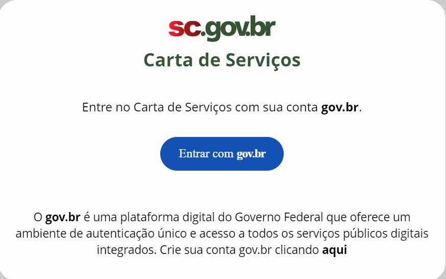

\ 

Na inexistência de uma conta vinculada ao perfil, o editor/revisor deverá criar a conta neste link (https://www.gov.br/pt-br/servicos/criar-sua-conta-gov.br). 

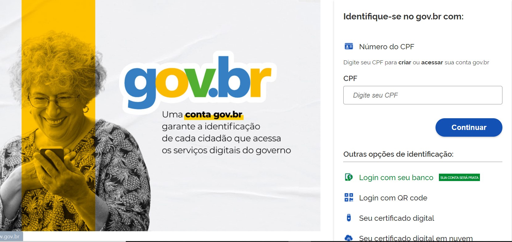
\ 

Após informar CPF...

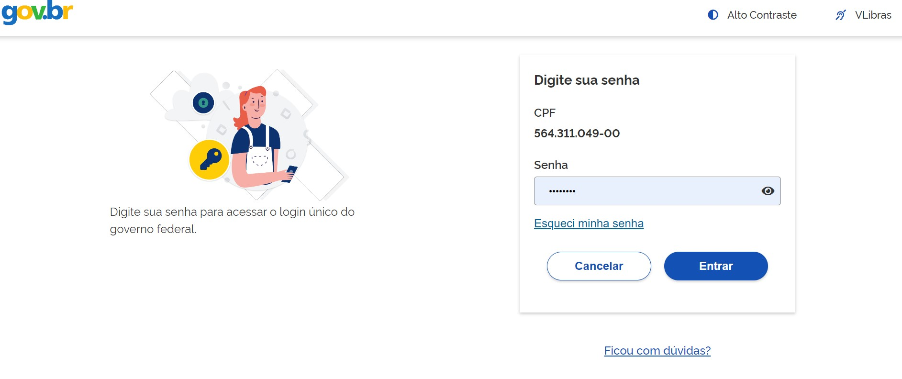

... e senha aparecerá uma tela para cadastro/alteração de serviços. Como a tela abaixo.

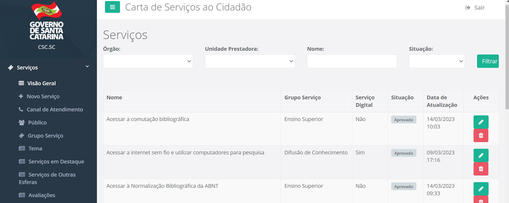
    
\  

Ao lado esquerdo da tela aparecerá a aba Serviços. Nela o usuário conseguirá ter uma visão geral dos serviços (do órgão ao qual ele está autorizado a alterar) se houverem serviços já cadastrados, estes serviços podem ser alterados/removidos. Também verá a opção **+ Novo Serviço** na qual poderá cadastrar um serviço inexistente até então.

Ao lado direito aparecerá as seguintes opções (na primeira linha):  

Órgão: 

Unidade Prestadora:  

Nome:

Observação: este é o nome do serviço para pesquisa/filtro.

Situação:  

São campos de filtragem que permitem selecionar visualizar determinados serviços vinculados aos filtros aplicados.

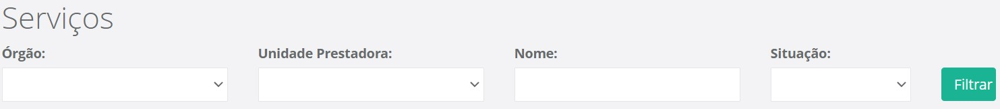

\ 

Na segunda linha, aparecerá os seguintes campos:  

Nome;  

Grupo Serviço;  

Serviço Digital;  

Situação;  

Data de Atualização;  

Ações. Este é o único campo que **NÃO** representa uma informação que será alimentada durante a inclusão de um novo serviço.

3. CRITÉRIOS PARA CADASTRAR UM SERVIÇO

**Um serviço gera valor para o cidadão!**

Para cadastramento dos serviços, alguns critérios devem ser observados no cadastramento dos serviços públicos prestados aos cidadãos/município/empresa, pautados nas orientações do Governo Federal.

3.1. COMO CADASTRAR O NOME DE UM SERVIÇO? 

O nome deve indicar uma ação (uma solicitação do cidadão ao órgão) devendo iniciar com verbo no infinitivo e ter poucas palavras. Exemplos de verbos: obter, renovar, declarar, cancelar, registrar, solicitar, etc. 

Exemplos de nomes de serviços: 

➔ Obter Vistoria de Habite-se  

➔ Renovar registro de empresas operadoras de transporte coletivo 

➔ Declarar viagem sem objetivo comercial 

➔ Cancelar DIEF-ITCMD 

➔ Registrar uma empresa 

➔ Solicitar ligação de água

Observação: o verbo solicitar é um dos mais utilizados pois na essência todo serviço é um solicitação.

Recomendações: 

➔ O nome do serviço deve ser **claro** quanto ao serviço e não fazer menção a apenas uma etapa do serviço: programa de governo, sistema, biblioteca, protocolo nem como ouvidoria ou SIC (Sistema de Informação ao Cidadão); 

➔ O campo deve ter entre 20 e 65 letras (incluindo espaços), **facilitando** assim os mecanismos de busca. O Google, por exemplo, exclui dos resultados frases com mais de 65 caracteres. Outro motivo é manter um padrão visual dos nomes dos serviços no portal; 

➔ O nome **não** deve ser parecido com outros já cadastrados no portal, o que pode confundir o cidadão nas buscas; 

➔ O público alvo **não** deve ser mencionado no item “Nome do Serviço”. Exemplo: Obter acesso à moradia digna no campo para famílias de baixa renda; 

➔ O nome do serviço **não** deve ser genérico, deve ser claro e bem descrito. Ao invés de “Carteira de Motorista” deve-se utilizar algo como “Solicitar Carteira de Habilitação (CNH)”. 

3.2. O QUE **NÃO** DEVE SER CADASTRADO COMO UM SERVIÇO? 

➔ Etapas de um serviço, como por exemplo: retirar/receber documentos, consultas de situação/andamento de serviço, retirar/receber licenças, pagamentos e agendamentos, emitir DAREs etc. são ações **não são serviços**. 

➔ Programas de Governo **não são serviços e não podem ser cadastrados como tal** por exemplo: *Minha Casa Minha Vida*. 

➔ Sistemas **não são serviços** o serviço que o sistema presta **sim**. Exemplo: “emitir nota fiscal eletrônica avulsa de ICMS” ou “solicitar cadastro do sistema X”. 

➔ Ouvidorias: não devem ser cadastradas como prestação de serviços. A recomendação é que cada órgão cadastre sua ouvidoria na sua página na internet. A Ouvidoria Geral do Estado será divulgada em um link no rodapé do portal da Carta de Serviços. 

Observação: A **PGE (Prcuradoria Geral do Estado)** é uma exceção. 

➔ Bibliotecas, acervos bibliográficos, consultas públicas, acervos documentais e legislações: os órgãos que **não possuem este serviço como atividade fim** não devem cadastrá-lo (são itens informacionais). 

➔ Protocolo: não é um serviço prestado pelo órgão e sim um canal presencial no qual se obtém serviços. Protocolar um documento, por exemplo, não gera valor para o cidadão. O serviço está no propósito para o qual aquele documento foi entregue – este é o serviço propriamente dito. 

Observação: existe uma exceção que é o Protocolo Digital. 

➔ Serviços internos do órgão: **não** são serviços acessados pelo cidadão e **não** devem ser cadastrados. 

➔ Relatórios de informações quantitativas e estatísticas: **não** são serviços e **não** devem ser cadastrados. Essas informações podem ser solicitadas via Sistema de Informação ao Cidadão (SIC). 

4. CADASTRANDO NO SISTEMA ADMINISTRATIVO CARTA DE SERVIÇO

4.1. FLUXO DO CADASTRAMENTO DO SERVIÇO

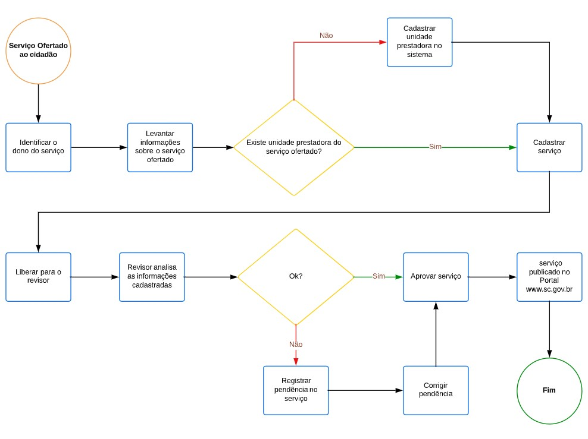

\

Antes de iniciar o cadastro de um serviço é importante buscar informações dos campos que necessitam ser preenchidos, finalidade, etapas, requisitos, local de acesso, unidade que o presta, telefone e principalmente, verificar se batem com as regras daquilo que pode ou não ser incluído na Carta de Serviços. O objetivo é evitar 
o cadastro de algo que não corresponda a um serviço prestado diretamente ao cidadão.
Após a compilação dos serviços prestados pelo órgão, contendo todas as informações pertinentes e necessárias para cadastramento do serviço, antes de cadastrá-lo, é momento de verificar todas as informações da unidade prestadora, que corresponde ao local onde o serviço é prestado.

Outros dois campos foram cadastrados previamente pela SCTI, que são os Temas e Grupos aos quais os serviços deverão estar relacionados. Caso não exista um tema ou grupo nas opções, basta solicitar a inclusão.

4.2. UNIDADE PRESTADORA 

A unidade prestadora é pré-requisito para inclusão de um serviço no portal administrativo, ou seja, antes de incluir qualquer serviço, deve-se listar e incluir separadamente no sistema todas as unidades prestadoras do órgão, que é o local onde o serviço é prestado. Deve conter as informações a seguir.

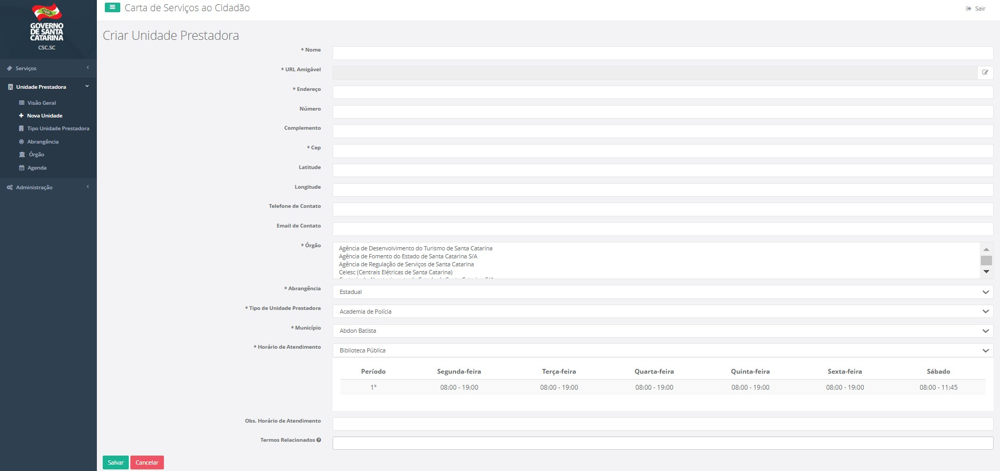
  
\ 

4.2.1. **Nome Da Unidade Prestadora** 
      
Especifique o nome da unidade prestadora. O ideal é que o nome não ultrapasse 65 caracteres. Exemplo: Delegacia 5º DP, Hospital Governador Celso Ramos, Escola Laura Lima, Posto de Fiscalização, Centro de Treinamento X, etc. 

4.2.2. **Endereço** Da Unidade Prestadora Inserir o logradouro (Av., Rua, Serv., Rodovia, etc) e o Bairro. 

4.2.3. **Complemento** Inserir o complemento do endereço, número, sala, bloco, nome do Prédio, etc. 

4.2.4. **CEP** Inserir o CEP do local, se caso não houver, incluir CEP geral do Município. 

4.2.5. **Latitude** Inserir a Latitude correspondente, (-27.541352, por exemplo) pode ser adquirida no google maps.

4.2.6. **Longitude** Inserir a Longitude correspondente. (-48.503371, por exemplo) pode ser adquirida no google maps. 

4.2.7. **Órgão** Inserir o órgão que a unidade prestadora está vinculada. 

4.2.8. **Abrangência** Informar a abrangência de atendimento da unidade prestadora, Municipal, Regional ou Estadual. 

4.2.9. **Tipo De** Unidade Prestadora Escolha entre os tipos pré cadastrados de unidade prestadora, caso não exista, pedir para ser incluída via email para SCTI. 

4.2.10. **Município** Selecionar o município onde está localizada a unidade prestadora.

4.2.11. **Horário De Atendimento** Escolher a agenda do horário de atendimento da unidade prestadora. Caso não exista, pedir para ser incluída via e-mail para SCTI. 

4.2.12. **Observação** Do Horário De Atendimento Escrever observação de horário de atendimento, caso necessite. 

5. CRIAR/INCLUIR UM NOVO SERVIÇO 

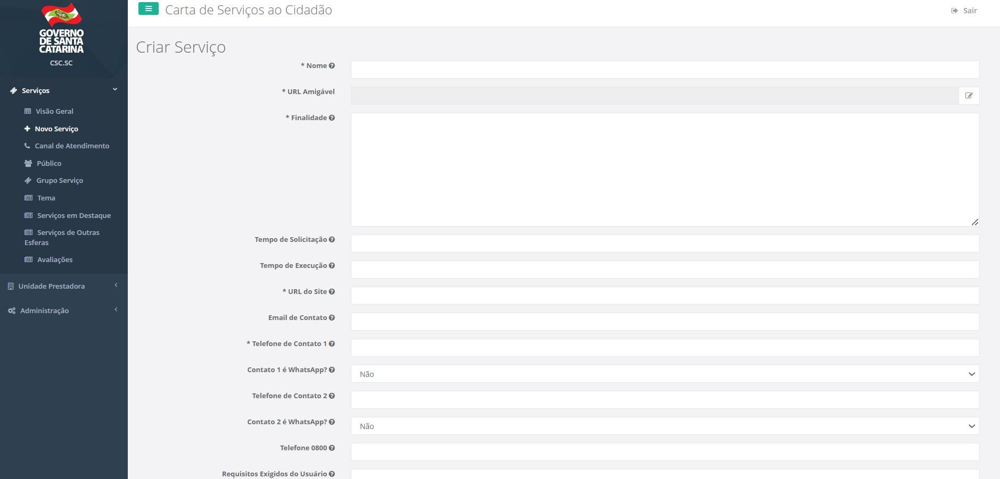
                                                                                                                                                                
\                                                                                                                                                                 
    
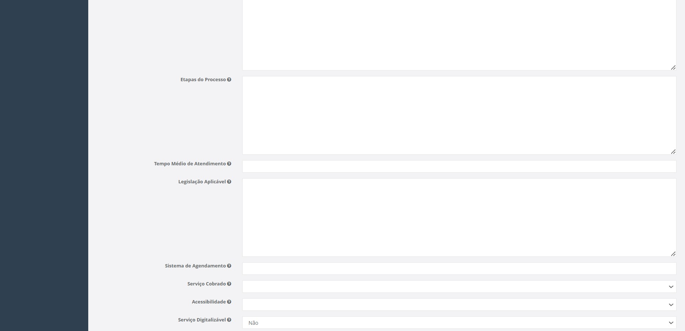
   
\ 

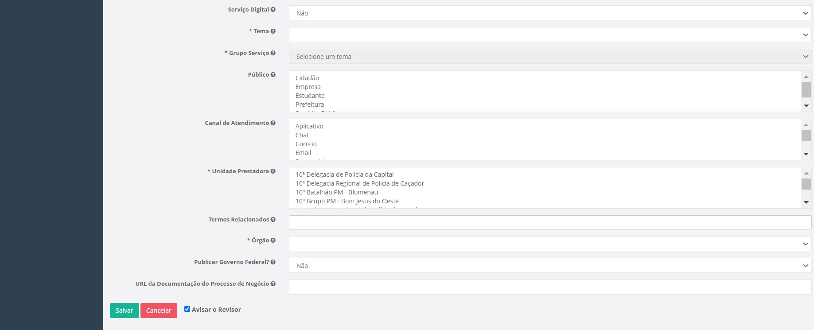

\ 

5.1. DISPOSIÇÕES GERAIS 

Para a inclusão de um novo serviço, clicar na aba “serviço” em seguida “+ Novo Serviço”. Os campos são preenchidos em formato texto, número ou selecionar opções pré definidas. São campos obrigatórios os que estão destacados com “*” asterisco na frente. Estes campos devem ser preenchidos para completar o cadastro mínimo. 

5.1.1. Nome Do Serviço 

Especifique o nome do serviço de maneira clara e objetiva. Use verbos no infinitivo, aqueles que indicam uma ação. Lembre-se de que, quanto menos palavras, melhor a busca no sistema. O ideal é que o nome não ultrapasse 65 caracteres.
Ex: Registrar Boletim de Ocorrência (BO). 

5.1.2. URL Amigável 

O termo URL está diretamente relacionado ao endereço de um site, de uma página. A URL amigável é uma URL mais fácil de ser compreendida, tanto para os buscadores como o Google, como para os usuários da página. 

Exemplo: URL amigável: acessar-cursos-de-educacao-a-distancia

URL simples: https://www.sc.gov.br/servicos/acessar-cursos-de-educacao-a-distancia

Por padrão, o sistema da Carta de Serviços preenche o campo URL Amigável com o nome do serviço e palavras separadas por hífen. Orienta-se que este campo não seja alterado.

5.1.3. **Finalidade** A descrição deve conter o resultado do que será entregue ao cidadão, ou seja, descreva o serviço de maneira simples e objetiva. Atenção para o limite de caracteres: 500 toques. 

Ex.: Carteira de Identidade (RG) tem por finalidade fornecer ao cidadão um registro geral no Estado de Santa Catarina. Para assegurar a identidade do portador, o RG contém informações como naturalidade, data de nascimento, assinatura, nome dos pais, além da fotografia do titular. A carteira de identidade possibilita entrar e sair pelos portos e aeroportos de estados brasileiros e nos países do Mercosul. Renovar a carteira de identidade a cada 10 anos para manter atualizada a fotografia.

5.1.4. **Tempo De Solicitação** Informe do tempo que o cidadão leva para solicitar o serviço. Este deve ser preenchido de duas formas: imediato ou numérico (1 hora).

5.1.5. **Tempo De Execução** Informe o tempo de execução do serviço após a solicitação ter sido processada pelo órgão competente. Este campo deve ser preenchido apenas em dias (ex.: 5 dias úteis, 30 dias corridos) 

5.1.6. **Url Do Site** Insira o link que leva direto ao serviço na internet. Caso não exista, coloque o endereço da página do órgão/instituição/secretaria e o caminho para acessar o serviço na descrição das etapas. 

5.1.7. **Email De Contato** Inserir o e-mail específico para atendimento do serviço prestado. Caso não exista, incluir o e-mail geral da instituição para atendimento. Não incluir e-mail pessoal: mudanças de funcionários desatualizam o cadastro com facilidade. 

5.1.8. **Telefone De Contato 1** Informe o telefone de contato/ramal direto de atendimento do serviço. Lembre-se de preencher o DDD. 

Nota: no campo seguinte que é **Contato 1 é WhatsApp?** é possível informar se o primeiro telefone de contato possui WhatsApp, basta selecionar SIM ou NÃO. 

5.1.9. **Telefone De Contato 2** Inserir outro telefone para atendimento do serviço prestado. Caso não exista, deixar em branco. 

Nota: no campo seguinte que é **Contato 2 é WhatsApp?** é possível informar se o segundo telefone de contato possui WhatsApp, basta selecionar SIM ou NÃO.

5.1.10. **Telefone 0800** Inserir o 0800 do serviço. Caso não exista, deixar em branco.

5.1.11. **Requisitos Exigidos Do Usuário** Os requisitos são basicamente os documentos ou pré-requisitos que o solicitante deve atender para ter direito aquele serviço. As etapas devem ser inseridas uma abaixo da outra, sem hífen (-), numeração(1,2,3) ou qualquer ponto a frente. 

**Exemplo serviço:** “Solicitar carteira de identidade” 

**Requisitos:** Ser brasileiro nato ou naturalizado; Brasileiros natos solteiros, com idade entre 6 e 60 anos, certidão de nascimento original ou cópia autenticada 
em cartório; 02 (duas) fotografias 3x4 com fundo branco, sem sorriso e adornos; Carteira de Identidade do responsável legal de menores de 16 anos. Caso seja 2ª via, pagar taxa referente à emissão.

Nota: um **Requisito básico** para solicitar um serviço é ter o login gov.br 

**Dica:** Para criar um título iniciar o texto com o símbolo “*” asterisco. O texto ficará com as letras maiúsculas e a numeração da listagem também será reiniciada. 

**Exemplo:** *Serviço Digital

Após a publicação, aparecerá da seguinte forma no Portal, conforme figura abaixo:

.. image:: images/ImagemMensagemPortal.jpg 
   :height: 80px
   :width: 80 px
   :scale: 100%
   :alt: tela mostrando mensagem do Portal
   :align: center 
  
 \ 
 
**Dica:** para os links de acesso que forem inseridos neste campo devem estar entre colchetes, no formato **[[link descrição]]** para que o link seja clicável. 

Exemplo: Enviar formulário de solicitação preenchido - [[http://scti.sc.gov.br/formulario-solicitacao acesse aqui]]

**Dica:** Para criar um título iniciar o texto com o símbolo “*” asterisco. O texto ficará com as letras maiúsculas e a numeração da listagem também será reiniciada. 

**Exemplo:** *On-line 

Após a publicação, aparecerá da seguinte forma no Portal, conforme figura abaixo: 

.. image:: images/ImagemMensagemPortal2.jpg 
   :height: 300px
   :width: 400 px
   :scale: 100%
   :alt: tela mostrando mensagem do Portal
   :align: center 
\ 

5.1.13. **Tempo Médio De Atendimento** Informe quanto tempo será necessário entre o pedido, o atendimento e a entrega do serviço. Ex.: 15 dias 

5.1.14. **Legislação Aplicável** Incluir a legislação que está vinculada ao serviço oferecido. Pode ser legislação exclusiva ou a lei que descreve as competências da instituição pública. 

Apenas incluir se é uma lei federal ou estadual, número da legislação e ano. Listando uma abaixo da outra, não é necessário descrever a legislação. E.x: Lei Complementar Estadual nºxxx/2019 
Decreto Estadual nº xxx/2018 

**Dica:** os links de acesso que forem inseridos neste campo devem estar entre colchetes, no formato **[[link descrição]]** para que o link seja clicável. 

Exemplo: Lei Federal no 8.666/1993 - [[http://www.planalto.gov.br/ccivil_03/leis/l8666cons.htm Consultar aqui]]

5.1.15. **Sistema De Agendamento** Este campo só deve ser preenchido, se houver um sistema específico de agendamento, devendo ser Inserida a URL do sistema de agendamento do serviço prestado. 

5.1.16. **Serviço Cobrado** Informe se o serviço é cobrado ou não. Selecione “sim” ou “não”. Não é necessário detalhar valores. 

5.1.17. **Acessibilidade** Informar se o local que presta o serviço presencial tem ou não acessibilidade. Informe “Sim” ou “Não”. 

5.1.18. **Serviço Digital** Informar se o serviço é prestado digitalmente, parcialmente digital ou não digital. 

Digital: significa que o cidadão realiza todas as etapas do serviço por meios digitais. 

Parcialmente digital: significa que o serviço possui alguma etapa digital, mas ainda é necessário que o cidadão compareça a unidade prestadora para apresentar ou retirar documentos/informação. 

Não digital: significa que o serviço não possui nenhuma etapa atendida por canal digital, somente presencial ou telefone, por exemplo. 

5.1.19. **Tema** Selecionar a área que o serviço está relacionado, de preferência vinculado à função principal do órgão. 

Exemplo: Agricultura, Educação, Desenvolvimento Econômico, etc. 

5.1.20. **Grupo de Serviço** 

Selecione um grupo no qual o serviço se enquadra. Exemplo: Se o tema é Educação, o grupo pode ser Ensino Fundamental. Se o tema é Empresas e Tributos, o grupo pode ser ICMS. 
Caso não exista na lista, solicitar a inclusão pelo e-mail oficial da Carta de Serviços. 

5.1.21. **Público** Escolher o público alvo do serviço. Para escolher mais de um, segurar a tecla Ctrl. 

5.1.22. **Canal De Atendimento** Selecionar a forma de atendimento do serviço prestado. Caso exista mais de um, segurar a tecla Ctrl. Exemplo: Presencial e Telefone. 

5.1.23. **Unidade Prestadora** 

Informe quais unidades oferecem o serviço, unidades prestadoras não são setores. Para escolher mais de um, basta segurar a tecla Ctrl. 

5.1.24. **Termos Relacionados**

Cadastre palavras chaves/TAGs para facilitar a busca no portal. Para inserir, escreva e pressione “Enter”. **Importante:** não use mais de quatro palavras na mesma TAG. Ex: CNH; Carteira de Motorista; Habilitação. 

5.1.25. **URL da Documentação do Processo de Negócio** link externo para acesso à documentação e diagramas de processo. Utilizado para quano o processo está devidamente mapeado.

6. REVISAR O SERVIÇO 

Após a inclusão do serviço por parte do Editor dos serviços, este serviço estará disponível com o status “disponível para revisão”, ou seja, é o momento de o Revisor do órgão acessar e verificar se as informações inseridas pelo Editor estão compatíveis com as regras de cada campo e se há alguma questão ortográfica que precisa ser revista. Os servidores cadastrados terão acesso somente às informações de sua instituição. 

Para revisar os itens previamente cadastrados é necessário clicar em “Editar Registro”, ícone verde. 

Caso seja necessário deletar algum serviço, basta clicar em “Excluir Registro”, ícone vermelho.

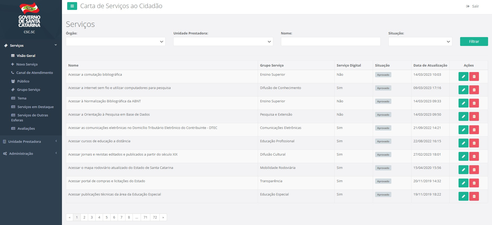
\ 

Após a revisão do serviço o revisor terá duas opções, incluir pendências ou aprová-lo, caso haja pendência, essas informações deverão constar no campo imediatamente após a situação selecionada, conforme figura abaixo. 

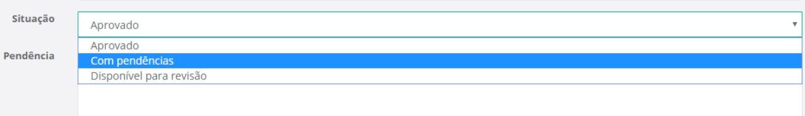
   
\ 
    
O perfil do Editor identifica os serviços que devem ser corrigidos pelo painel principal na coluna “Situação” e uma mensagem é encaminhada por e-mail, indicando que aquele serviço foi colocado na situação “com pendências”.
   
Ao entrar no editor do serviço, o painel indica na parte superior (laranja) qual a pendência que precisa ser corrigida. 

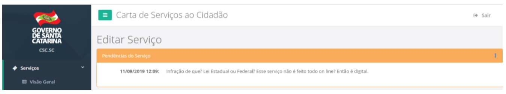
   
\ 

Para correção das pendências o Editor deve editar o serviço em questão e sanar os problemas levantados. Após isso, novamente o serviço fica disponível para revisão para homologação do revisor do órgão, finalizando o processo de inclusão do serviço, com a aprovação. 

Feito este processo o serviço automaticamente será publicado no portal sc.gov.br/servicos
