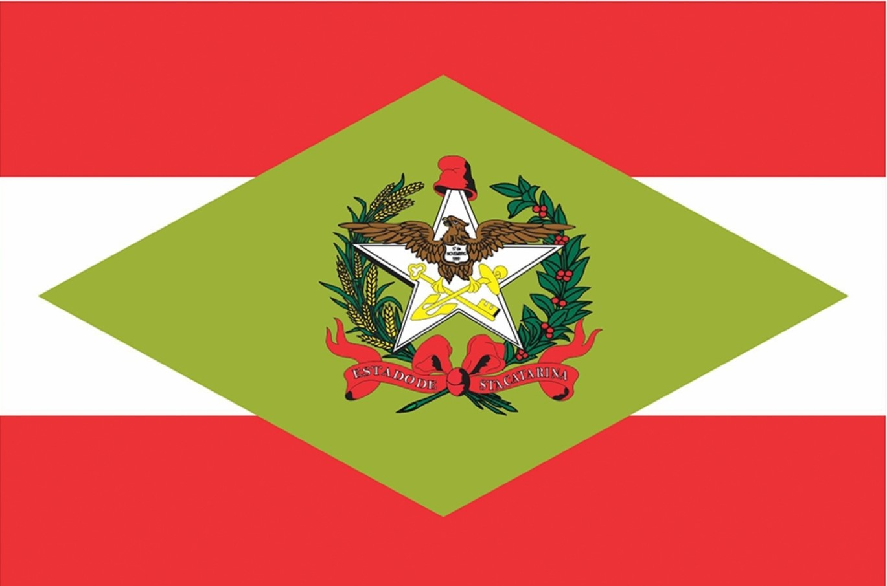

Guia do Sistema Administrativo Carta de Serviços (SACS) | 2023
==================================================================================

**Carta de Serviços ao Cidadão** (sc.gov.br)

O Governo do Estado de Santa Catarina adotou algumas estratégias para contribuir com o avanço tecnológico e entregar seus serviços em nível de excelência ao cidadão. Uma dessas estratégias é o avanço na implementação de temas como o Governo Digital. O plano de um governo sem papel contribuiu, por exemplo, para a digitalização de serviços, organização da informação a fim de gerar conhecimentos no âmbito da gestão pública, a interligação de sistemas interoperáveis do Estado, a contribuição para a redução das contas públicas, trazendo transparência, bem como outras contribuições para a prestação dos serviços públicos. Corroborando com essa estratégia, uma das metas do governo é a de deixar disponíveis e atualizados os serviços prestados pelo Estado ao cidadão.

Estes serviços estão atualmente disponíveis para serem consumidos pelo cidadão por meio do novo portal de serviços do estado, o  www.sc.gov.br. Lá pode-se encontrar pouco mais de 660 serviços, sendo distribuídos entre 40 órgãos e entidades do Poder Executivo estadual sobre diversos temas como educação, segurança pública, saúde, etc., além de outras informações pertinentes aos serviços ofertados ao cidadão. Esse agrupamento dos serviços pode ser denominado como Carta de Serviços. Em **Santa Catarina, a Lei n° 15.435/2011** dispõe sobre a simplificação do atendimento público prestado ao cidadão e institui a Carta Estadual de Serviços ao Cidadão. 

“Art. 11. Os órgãos e entidades do Poder Executivo estadual que prestam serviços diretamente ao cidadão, deverão elaborar e divulgar Carta Estadual de Serviços ao Cidadão, no âmbito de sua esfera de competência.” 

Atualmente a Secretaria do Estado da Administração (SEA), por meio da Diretoria de Tecnologia e Inovação (DITI), é a responsável pela definição das diretrizes da Carta de Serviços ao Cidadão. A Carta de Serviços pode ser vista como um ambiente digital (repositório digital) contendo diversas informações pertinentes aos serviços ofertados pelos órgãos e entidades do Poder Executivo estadual. 

    
    
2. INFORMAÇÕES GERAIS 

O Governo do Estado está desenvolvendo o plano de transformação digital, e para isso os órgãos precisam atualizar a carta de serviços, de modo a possuir o censo de TODOS os serviços do estado prestados diretamente ao cidadão.
E para isso a Carta de Serviços ao Cidadão precisa ser revisada constantemente e deve contemplar 100% dos serviços prestados pelo estado, digitais ou não. 
Para acesso ao sistema Carta (https://cartaservicos-adm.ciasc.gov.br) é necessário possuir o login gov.br.  

2.1. PERFIS DE ACESSO  

O órgão deve eleger, no mínimo, dois servidores que serão responsáveis por coletar, inserir e revisar os serviços. Este número pode variar para cima de acordo com o porte do órgão.  

O sistema contempla dois perfis (editor e revisor), que devem ser pessoas distintas:  

* Editor: cadastrar os serviços e corrigir eventuais pendências;
* Revisor: revisar os textos, informações e aprovar os serviços cadastrados ou editados. Pode ainda indicar a existência de pendências para o Editor corrigir. 
* Administrador: perfil com acesso a todos os cadastros e serviços. Este perfil é exclusivo do órgão responsável por cadastrar os usuários no sistema Carta.

Importante observar que o editor é aquele que irá inserir no sistema administrativos as informações sobre os serviços que o órgão dispõe. Já o revisor irá conferir, sugerir alterações e aprovar a inclusão do material no sistema. 
Cabe ressaltar, que o serviço só é publicado e fica disponível no portal (https://www.sc.gov.br/servicos), após aprovação do revisor.
Por convenção, adotou-se o assessor de comunicação o revisor dos serviços.
Caso o órgão não tenha cadastrado um usuário editor e/ou um revisor, deve-se encaminhar e-mail para cartadeservicos@sea.sc.gov.br com os dados abaixo para cadastro:  

➔ Nome Completo;  

➔ Email institucional;  

➔ Perfil de acesso Editor ou Revisor;  

➔ CPF;  

➔ Órgão ao qual está vinculado; 

➔ Lotação/Setor;  

➔ Contato.

2.2. ACESSO AO SISTEMA  

O acesso ao sistema Carta dar-se-á pelo login gov.br portanto é neceesário ter uma conta gov.br.

.. image:: images/loginGovBr.jpg 
   :height: 250px
   :width: 400 px
   :scale: 100%
   :alt: tela de login gov br
   :align: center 
    
    
Na inexistência de uma conta vinculada ao perfil, o editor/revisor deverá criar a conta neste link (https://www.gov.br/pt-br/servicos/criar-sua-conta-gov.br). 

.. image:: images/loginGovBrCPF.jpg 
   :height: 250px
   :width: 400 px
   :scale: 100%
   :alt: tela de login gov br solicitando o CPF
   :align: center 

Após informar CPF...

.. image:: images/loginGovBrSenha.jpg 
   :height: 250px
   :width: 400 px
   :scale: 100%
   :alt: tela de login gov br solicitando a senha
   :align: center 

... e senha aparecerá uma tela para cadastro/alteração de serviços. Como a tela abaixo.

.. image:: images/ExemploTelaDoCarta.jpg 
   :height: 250px
   :width: 400 px
   :scale: 100%
   :alt: tela mostrando o sistema Carta de Serviços
   :align: center 
    
    

Ao lado esquerdo da tela aparecerá a aba Serviços. Nela o usuário conseguirá ter uma visão geral dos serviços (do órgão ao qual ele está autorizado a alterar) se houverem serviços já cadastrados, estes serviços podem ser alterados/removidos. Também verá a opção **+ Novo Serviço** na qual poderá cadastrar um serviço inexistente até então.

Ao lado direito aparecerá as seguintes opções (na primeira linha):  

Órgão: 

Unidade Prestadora:  

Nome:

Observação: este é o nome do serviço para pesquisa/filtro.

Situação:  

São campos de filtragem que permitem selecionar visualizar determinados serviços vinculados aos filtros aplicados.

Na segunda linha, aparecerá os seguintes campos:  

Nome;  

Grupo Serviço;  

Serviço Digital;  

Situação;  

Data de Atualização;  

Ações. Este é o único campo que **NÃO** representa uma informação que será alimentada durante a inclusão de um novo serviço.

3. CRITÉRIOS PARA CADASTRAR UM SERVIÇO DITI/SEA

**Um serviço gera valor para o cidadão!**

Para cadastramento dos serviços, alguns critérios devem ser observados no cadastramento dos serviços públicos prestados aos cidadãos/município/empresa, pautados nas orientações do Governo Federal.

3.1. COMO CADASTRAR O NOME DE UM SERVIÇO? 

O nome deve indicar uma ação (uma solicitação do cidadão ao órgão) devendo iniciar com verbo no infinitivo e ter poucas palavras. Exemplos de verbos: obter, manter, renovar, declarar, cancelar, registrar, solicitar, etc. 

Exemplos de nomes de serviços: 

➔ Obter Vistoria de Habite-se  

➔ Manter **(não encontrei serviço com este verbo)** 

➔ Renovar registro de empresas operadoras de transporte coletivo 

➔ Declarar viagem sem objetivo comercial 

➔ Cancelar DIEF-ITCMD 

➔ Registrar uma empresa 

➔ Solicitar ligação de água

Observação: o verbo solicitar é um dos mais utilizados pois na essência todo serviço é um solicitação.

Recomendações: 

➔ O nome do serviço deve ser claro quanto ao serviço e não fazer menção a apenas uma etapa do serviço: programa de governo, sistema, biblioteca, protocolo nem como ouvidoria ou SIC (Sistema de Informação ao Cidadão); 

➔ O campo deve ter entre 20 e 65 letras (incluindo espaços), facilitando assim os mecanismos de busca. O Google, por exemplo, exclui dos resultados frases com mais de 65 caracteres. Outro motivo é manter um padrão visual dos nomes dos serviços no portal; 

➔ O nome não deve ser parecido com outros já cadastrados no portal, o que pode confundir o cidadão nas buscas; 

➔ O público alvo não deve ser mencionado no item “Nome do Serviço”. Exemplo: Obter acesso à moradia digna no campo para famílias de baixa renda; 

➔ O nome do serviço não deve ser genérico, deve ser claro e bem descrito. Ao invés de “Carteira de Motorista” deve-se utilizar algo como “Solicitar Carteira de Habilitação (CNH)”. 

3.2. O QUE **NÃO** DEVE SER CADASTRADO COMO UM SERVIÇO? 

➔ Etapas de um serviço, como por exemplo: retirar/receber documentos, consultas de situação/andamento de serviço, retirar/receber licenças, pagamentos e agendamentos, emitir DAREs etc. são ações **não são serviços**. 

➔ Programas de Governo **não são serviços e não podem ser cadastrados como tal** por exemplo: Minha Casa Minha Vida. 

➔ Sistemas **não são serviços** o serviço que o sistema presta **sim**. Exemplo: “emitir nota fiscal eletrônica avulsa de ICMS” ou “solicitar cadastro do sistema X”. 

➔ Ouvidorias: não devem ser cadastradas como prestação de serviços. A recomendação é que cada órgão cadastre sua ouvidoria na sua página na internet. A Ouvidoria Geral do Estado será divulgada em um link no rodapé do portal da Carta de Serviços. 

Observação: existem algumas ouvidorias que estão cadastradas como serviço. 

➔ Bibliotecas, acervos bibliográficos, consultas públicas, acervos documentais e legislações: os órgãos que **não possuem este serviço como atividade fim** não devem cadastrá-lo (são itens informacionais). 

➔ Protocolo: não é um serviço prestado pelo órgão e sim um canal presencial no qual se obtém serviços. Protocolar um documento, por exemplo, não gera valor para o cidadão. O serviço está no propósito para o qual aquele documento foi entregue – este é o serviço propriamente dito. 

Observação: existe uma exceção que é o Protocolo Digital. 

➔ Serviços internos do órgão: não são serviços acessados pelo cidadão e **não** devem ser cadastrados. 

➔ Relatórios de informações quantitativas e estatísticas: não são serviços e **não** devem ser cadastrados. Essas informações podem ser solicitadas via Sistema de Informação ao Cidadão (SIC). 

